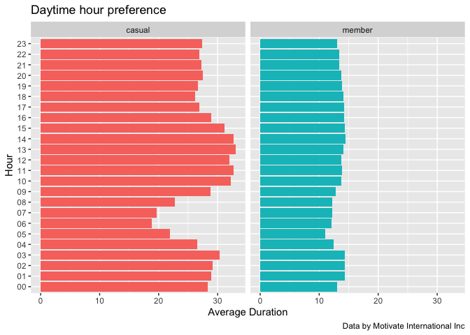

capstone-notebook
================
Yaad Nahshon
11/15/2021

# The Study

## Step 1 - Ask

**Key tasks**

1.  Identify the business task

2.  Consider key stakeholders

**The business task**

How do annual members and casual riders use Cyclistic bikes differently?

**Key stakeholders**

1.  Cyclistic executive team.

2.  Lily Moreno - director of marketing and my manager.

------------------------------------------------------------------------

## Step 2 - Prepare

**Key tasks**

1.  Download data and store it appropriately.

-   All data were collected from
    [here](https://divvy-tripdata.s3.amazonaws.com/index.html).

1.  Identify how it’s organized.

2.  Sort and filter the data.

3.  Determine the credibility of the data.

### Libraries setup

``` r
library(tidyverse)
library(lubridate)
library(ggplot2)
library(gridExtra)
library(scales)
```

### Data import

``` r
f1_2020_11 <- read_csv("202011-divvy-tripdata.csv")
f2_2020_12 <- read_csv("202012-divvy-tripdata.csv")
f3_2021_01 <- read_csv("202101-divvy-tripdata.csv")
f4_2021_02 <- read_csv("202102-divvy-tripdata.csv")
f5_2021_03 <- read_csv("202103-divvy-tripdata.csv")
f6_2021_04 <- read_csv("202104-divvy-tripdata.csv")
f7_2021_05 <- read_csv("202105-divvy-tripdata.csv")
f8_2021_06 <- read_csv("202106-divvy-tripdata.csv")
f9_2021_07 <- read_csv("202107-divvy-tripdata.csv")
f10_2021_08 <- read_csv("202108-divvy-tripdata.csv")
f11_2021_09 <- read_csv("202109-divvy-tripdata.csv")
f12_2021_10 <- read_csv("202110-divvy-tripdata.csv")
```

Inspect the dataframes and look for incongruencies

``` r
dim(f1_2020_11)

colnames(f1_2020_11)
glimpse(f1_2020_11)
colnames(f2_2020_12)
glimpse(f2_2020_12)
colnames(f3_2021_01)
glimpse(f3_2021_01)
colnames(f4_2021_02)
glimpse(f4_2021_02)
colnames(f5_2021_03)
glimpse(f5_2021_03)
colnames(f6_2021_04)
glimpse(f6_2021_04)
colnames(f7_2021_05)
glimpse(f7_2021_05)
colnames(f8_2021_06)
glimpse(f8_2021_06)
colnames(f9_2021_07)
glimpse(f9_2021_07)
colnames(f10_2021_08)
glimpse(f10_2021_08)
colnames(f11_2021_09)
glimpse(f11_2021_09)
colnames(f12_2021_10)
glimpse(f12_2021_10)

str(f1_2020_11)
str(f2_2020_12)
str(f3_2021_01)
str(f4_2021_02)
str(f5_2021_03)
str(f6_2021_04)
str(f7_2021_05)
str(f8_2021_06)
str(f9_2021_07)
str(f10_2021_08)
str(f11_2021_09)
str(f12_2021_10)
```

Convert start_station_id and end_station_id to character so that they
can stack correctly

``` r
f1_2020_11 <- mutate(f1_2020_11, start_station_id = as.character(start_station_id),
                  end_station_id = as.character(end_station_id)) 
```

Stack individual month’s data frames into one big data frame

``` r
all_trips <- bind_rows(f1_2020_11, f2_2020_12, f3_2021_01, f4_2021_02, f5_2021_03, f6_2021_04, f7_2021_05, f8_2021_06, f9_2021_07, f10_2021_08, f11_2021_09, f12_2021_10)
```

------------------------------------------------------------------------

## Step 3 - Process

**Key tasks**

1.  Check the data for errors.

2.  Choose your tools.

3.  Transform the data so you can work with it effectively.

4.  Document the cleaning process.

Inspect the new table that has been created

``` r
colnames(all_trips)
```

    ##  [1] "ride_id"            "rideable_type"      "started_at"        
    ##  [4] "ended_at"           "start_station_name" "start_station_id"  
    ##  [7] "end_station_name"   "end_station_id"     "start_lat"         
    ## [10] "start_lng"          "end_lat"            "end_lng"           
    ## [13] "member_casual"

``` r
dim(all_trips)
```

    ## [1] 5378834      13

``` r
head(all_trips)
```

    ## # A tibble: 6 × 13
    ##   ride_id          rideable_type started_at          ended_at            start_station_n…
    ##   <chr>            <chr>         <dttm>              <dttm>              <chr>           
    ## 1 BD0A6FF6FFF9B921 electric_bike 2020-11-01 13:36:00 2020-11-01 13:45:40 Dearborn St & E…
    ## 2 96A7A7A4BDE4F82D electric_bike 2020-11-01 10:03:26 2020-11-01 10:14:45 Franklin St & I…
    ## 3 C61526D06582BDC5 electric_bike 2020-11-01 00:34:05 2020-11-01 01:03:06 Lake Shore Dr &…
    ## 4 E533E89C32080B9E electric_bike 2020-11-01 00:45:16 2020-11-01 00:54:31 Leavitt St & Ch…
    ## 5 1C9F4EF18C168C60 electric_bike 2020-11-01 15:43:25 2020-11-01 16:16:52 Buckingham Foun…
    ## 6 7259585D8276D338 electric_bike 2020-11-14 15:55:17 2020-11-14 16:44:38 Wabash Ave & 16…
    ## # … with 8 more variables: start_station_id <chr>, end_station_name <chr>,
    ## #   end_station_id <chr>, start_lat <dbl>, start_lng <dbl>, end_lat <dbl>,
    ## #   end_lng <dbl>, member_casual <chr>

``` r
str(all_trips)
```

    ## spec_tbl_df [5,378,834 × 13] (S3: spec_tbl_df/tbl_df/tbl/data.frame)
    ##  $ ride_id           : chr [1:5378834] "BD0A6FF6FFF9B921" "96A7A7A4BDE4F82D" "C61526D06582BDC5" "E533E89C32080B9E" ...
    ##  $ rideable_type     : chr [1:5378834] "electric_bike" "electric_bike" "electric_bike" "electric_bike" ...
    ##  $ started_at        : POSIXct[1:5378834], format: "2020-11-01 13:36:00" "2020-11-01 10:03:26" ...
    ##  $ ended_at          : POSIXct[1:5378834], format: "2020-11-01 13:45:40" "2020-11-01 10:14:45" ...
    ##  $ start_station_name: chr [1:5378834] "Dearborn St & Erie St" "Franklin St & Illinois St" "Lake Shore Dr & Monroe St" "Leavitt St & Chicago Ave" ...
    ##  $ start_station_id  : chr [1:5378834] "110" "672" "76" "659" ...
    ##  $ end_station_name  : chr [1:5378834] "St. Clair St & Erie St" "Noble St & Milwaukee Ave" "Federal St & Polk St" "Stave St & Armitage Ave" ...
    ##  $ end_station_id    : chr [1:5378834] "211" "29" "41" "185" ...
    ##  $ start_lat         : num [1:5378834] 41.9 41.9 41.9 41.9 41.9 ...
    ##  $ start_lng         : num [1:5378834] -87.6 -87.6 -87.6 -87.7 -87.6 ...
    ##  $ end_lat           : num [1:5378834] 41.9 41.9 41.9 41.9 41.9 ...
    ##  $ end_lng           : num [1:5378834] -87.6 -87.7 -87.6 -87.7 -87.6 ...
    ##  $ member_casual     : chr [1:5378834] "casual" "casual" "casual" "casual" ...
    ##  - attr(*, "spec")=
    ##   .. cols(
    ##   ..   ride_id = col_character(),
    ##   ..   rideable_type = col_character(),
    ##   ..   started_at = col_datetime(format = ""),
    ##   ..   ended_at = col_datetime(format = ""),
    ##   ..   start_station_name = col_character(),
    ##   ..   start_station_id = col_double(),
    ##   ..   end_station_name = col_character(),
    ##   ..   end_station_id = col_double(),
    ##   ..   start_lat = col_double(),
    ##   ..   start_lng = col_double(),
    ##   ..   end_lat = col_double(),
    ##   ..   end_lng = col_double(),
    ##   ..   member_casual = col_character()
    ##   .. )
    ##  - attr(*, "problems")=<externalptr>

``` r
summary(all_trips)
```

    ##    ride_id          rideable_type        started_at                 
    ##  Length:5378834     Length:5378834     Min.   :2020-11-01 00:00:08  
    ##  Class :character   Class :character   1st Qu.:2021-05-17 12:45:18  
    ##  Mode  :character   Mode  :character   Median :2021-07-13 22:33:14  
    ##                                        Mean   :2021-06-27 18:37:41  
    ##                                        3rd Qu.:2021-09-02 18:18:14  
    ##                                        Max.   :2021-10-31 23:59:49  
    ##                                                                     
    ##     ended_at                   start_station_name start_station_id  
    ##  Min.   :2020-11-01 00:02:20   Length:5378834     Length:5378834    
    ##  1st Qu.:2021-05-17 13:07:36   Class :character   Class :character  
    ##  Median :2021-07-13 22:57:23   Mode  :character   Mode  :character  
    ##  Mean   :2021-06-27 18:58:10                                        
    ##  3rd Qu.:2021-09-02 18:35:16                                        
    ##  Max.   :2021-11-03 21:45:48                                        
    ##                                                                     
    ##  end_station_name   end_station_id       start_lat       start_lng     
    ##  Length:5378834     Length:5378834     Min.   :41.64   Min.   :-87.84  
    ##  Class :character   Class :character   1st Qu.:41.88   1st Qu.:-87.66  
    ##  Mode  :character   Mode  :character   Median :41.90   Median :-87.64  
    ##                                        Mean   :41.90   Mean   :-87.65  
    ##                                        3rd Qu.:41.93   3rd Qu.:-87.63  
    ##                                        Max.   :42.08   Max.   :-87.52  
    ##                                                                        
    ##     end_lat         end_lng       member_casual     
    ##  Min.   :41.51   Min.   :-88.07   Length:5378834    
    ##  1st Qu.:41.88   1st Qu.:-87.66   Class :character  
    ##  Median :41.90   Median :-87.64   Mode  :character  
    ##  Mean   :41.90   Mean   :-87.65                     
    ##  3rd Qu.:41.93   3rd Qu.:-87.63                     
    ##  Max.   :42.17   Max.   :-87.44                     
    ##  NA's   :4831    NA's   :4831

Inspect NaN values

``` r
colSums(is.na(all_trips))
```

    ##            ride_id      rideable_type         started_at           ended_at 
    ##                  0                  0                  0                  0 
    ## start_station_name   start_station_id   end_station_name     end_station_id 
    ##             600479             600586             646471             646548 
    ##          start_lat          start_lng            end_lat            end_lng 
    ##                  0                  0               4831               4831 
    ##      member_casual 
    ##                  0

### Remove bad data

Remove lat, long, birthyear

``` r
all_trips_v2 <- all_trips %>%
  select(-c(start_lat, start_lng, end_lat, end_lng))
```

### Adding date formats

Add columns that list the date, month, day, hour and year of each ride.

``` r
all_trips_v2$date <- as.Date(all_trips_v2$started_at) #The default format is yyyy-mm-dd
all_trips_v2$month <- format(as.Date(all_trips_v2$date), "%m")
all_trips_v2$day <- format(as.Date(all_trips_v2$date), "%d")
all_trips_v2$year <- format(as.Date(all_trips_v2$date), "%Y")
all_trips_v2$day_of_week <- format(as.Date(all_trips_v2$date), "%A")
all_trips_v2$hour <- format(as.POSIXct(all_trips_v2$started_at), format = "%H")

all_trips_v2$day_of_week <- 
  ordered(all_trips_v2$day_of_week, levels=c("Sunday", "Monday", "Tuesday",
                                             "Wednesday", "Thursday", 
                                             "Friday", "Saturday"))
```

Add a “ride_length” calculation to all_trips_v2 (in seconds).

``` r
all_trips_v2$ride_length <- difftime(all_trips_v2$ended_at,all_trips_v2$started_at)

# Inspect the structure of the columns
str(all_trips_v2)
```

    ## tibble [5,378,834 × 16] (S3: tbl_df/tbl/data.frame)
    ##  $ ride_id           : chr [1:5378834] "BD0A6FF6FFF9B921" "96A7A7A4BDE4F82D" "C61526D06582BDC5" "E533E89C32080B9E" ...
    ##  $ rideable_type     : chr [1:5378834] "electric_bike" "electric_bike" "electric_bike" "electric_bike" ...
    ##  $ started_at        : POSIXct[1:5378834], format: "2020-11-01 13:36:00" "2020-11-01 10:03:26" ...
    ##  $ ended_at          : POSIXct[1:5378834], format: "2020-11-01 13:45:40" "2020-11-01 10:14:45" ...
    ##  $ start_station_name: chr [1:5378834] "Dearborn St & Erie St" "Franklin St & Illinois St" "Lake Shore Dr & Monroe St" "Leavitt St & Chicago Ave" ...
    ##  $ start_station_id  : chr [1:5378834] "110" "672" "76" "659" ...
    ##  $ end_station_name  : chr [1:5378834] "St. Clair St & Erie St" "Noble St & Milwaukee Ave" "Federal St & Polk St" "Stave St & Armitage Ave" ...
    ##  $ end_station_id    : chr [1:5378834] "211" "29" "41" "185" ...
    ##  $ member_casual     : chr [1:5378834] "casual" "casual" "casual" "casual" ...
    ##  $ date              : Date[1:5378834], format: "2020-11-01" "2020-11-01" ...
    ##  $ month             : chr [1:5378834] "11" "11" "11" "11" ...
    ##  $ day               : chr [1:5378834] "01" "01" "01" "01" ...
    ##  $ year              : chr [1:5378834] "2020" "2020" "2020" "2020" ...
    ##  $ day_of_week       : Ord.factor w/ 7 levels "Sunday"<"Monday"<..: 1 1 1 1 1 7 7 7 7 7 ...
    ##  $ hour              : chr [1:5378834] "13" "10" "00" "00" ...
    ##  $ ride_length       : 'difftime' num [1:5378834] 580 679 1741 555 ...
    ##   ..- attr(*, "units")= chr "secs"

Convert “ride_length” from Factor to numeric so we can run calculations
on the data

``` r
is.factor(all_trips_v2$ride_length)
all_trips_v2$ride_length <- as.numeric(as.character(all_trips_v2$ride_length))
is.numeric(all_trips_v2$ride_length)
```

There are no invaluable NaN rows to be removed

``` r
colSums(is.na(all_trips_v2))
```

    ##            ride_id      rideable_type         started_at           ended_at 
    ##                  0                  0                  0                  0 
    ## start_station_name   start_station_id   end_station_name     end_station_id 
    ##             600479             600586             646471             646548 
    ##      member_casual               date              month                day 
    ##                  0                  0                  0                  0 
    ##               year        day_of_week               hour        ride_length 
    ##                  0                  0                  0                  0

Inspect station names

``` r
unique_station_names = sort(intersect(unique(all_trips_v2$start_station_name), unique(all_trips_v2$end_station_name)))
```

Fix ride length

``` r
distinct(all_trips_v2) # no duplicates
```

    ## # A tibble: 5,378,834 × 16
    ##    ride_id          rideable_type started_at          ended_at           
    ##    <chr>            <chr>         <dttm>              <dttm>             
    ##  1 BD0A6FF6FFF9B921 electric_bike 2020-11-01 13:36:00 2020-11-01 13:45:40
    ##  2 96A7A7A4BDE4F82D electric_bike 2020-11-01 10:03:26 2020-11-01 10:14:45
    ##  3 C61526D06582BDC5 electric_bike 2020-11-01 00:34:05 2020-11-01 01:03:06
    ##  4 E533E89C32080B9E electric_bike 2020-11-01 00:45:16 2020-11-01 00:54:31
    ##  5 1C9F4EF18C168C60 electric_bike 2020-11-01 15:43:25 2020-11-01 16:16:52
    ##  6 7259585D8276D338 electric_bike 2020-11-14 15:55:17 2020-11-14 16:44:38
    ##  7 91FE5C8F8A676594 electric_bike 2020-11-14 16:47:29 2020-11-14 17:03:03
    ##  8 9E7A79ADA90C2695 electric_bike 2020-11-14 16:04:15 2020-11-14 16:19:33
    ##  9 A5B02C0D41DBCDAF electric_bike 2020-11-14 16:24:09 2020-11-14 16:51:34
    ## 10 8234407C29FE41DC electric_bike 2020-11-14 01:24:22 2020-11-14 01:31:42
    ## # … with 5,378,824 more rows, and 12 more variables: start_station_name <chr>,
    ## #   start_station_id <chr>, end_station_name <chr>, end_station_id <chr>,
    ## #   member_casual <chr>, date <date>, month <chr>, day <chr>, year <chr>,
    ## #   day_of_week <ord>, hour <chr>, ride_length <dbl>

``` r
# Remove ride_length <= 60 or ride_length > 60*60*24
rides_to_be_removed <- subset(all_trips_v2, ride_length <= 60 | ride_length > 60*60*24)
all_trips_fixed_rides_length <- subset(all_trips_v2, ride_length > 60 & ride_length <= 60*60*24)
```

Drop bad station names

``` r
# Remove test (26), repair (8) and check (26) start and end stations

all_trips_v3 <- all_trips_fixed_rides_length[!grepl("TEST", all_trips_fixed_rides_length$start_station_name) & !grepl("TEST", all_trips_fixed_rides_length$end_station_name),]

all_trips_v3 <- all_trips_fixed_rides_length[!grepl("REPAIR", all_trips_fixed_rides_length$start_station_name) & !grepl("REPAIR", all_trips_fixed_rides_length$end_station_name),]

all_trips_v3 <- all_trips_fixed_rides_length[!grepl("CHECKING", all_trips_fixed_rides_length$start_station_name) & !grepl("CHECKING", all_trips_fixed_rides_length$end_station_name),]
```

``` r
colSums(is.na(all_trips_v3))
```

    ##            ride_id      rideable_type         started_at           ended_at 
    ##                  0                  0                  0                  0 
    ## start_station_name   start_station_id   end_station_name     end_station_id 
    ##             581709             581808             621545             621614 
    ##      member_casual               date              month                day 
    ##                  0                  0                  0                  0 
    ##               year        day_of_week               hour        ride_length 
    ##                  0                  0                  0                  0

``` r
all_trips_v4 <- drop_na(all_trips_v3)
colSums(is.na(all_trips_v4))
```

    ##            ride_id      rideable_type         started_at           ended_at 
    ##                  0                  0                  0                  0 
    ## start_station_name   start_station_id   end_station_name     end_station_id 
    ##                  0                  0                  0                  0 
    ##      member_casual               date              month                day 
    ##                  0                  0                  0                  0 
    ##               year        day_of_week               hour        ride_length 
    ##                  0                  0                  0                  0

### Renaming

Column renaming for easy life

``` r
(all_trips_v4 <- rename(all_trips_v4,
                  user_type = member_casual))
```

    ## # A tibble: 4,432,377 × 16
    ##    ride_id          rideable_type started_at          ended_at           
    ##    <chr>            <chr>         <dttm>              <dttm>             
    ##  1 BD0A6FF6FFF9B921 electric_bike 2020-11-01 13:36:00 2020-11-01 13:45:40
    ##  2 96A7A7A4BDE4F82D electric_bike 2020-11-01 10:03:26 2020-11-01 10:14:45
    ##  3 C61526D06582BDC5 electric_bike 2020-11-01 00:34:05 2020-11-01 01:03:06
    ##  4 E533E89C32080B9E electric_bike 2020-11-01 00:45:16 2020-11-01 00:54:31
    ##  5 1C9F4EF18C168C60 electric_bike 2020-11-01 15:43:25 2020-11-01 16:16:52
    ##  6 7259585D8276D338 electric_bike 2020-11-14 15:55:17 2020-11-14 16:44:38
    ##  7 91FE5C8F8A676594 electric_bike 2020-11-14 16:47:29 2020-11-14 17:03:03
    ##  8 A5B02C0D41DBCDAF electric_bike 2020-11-14 16:24:09 2020-11-14 16:51:34
    ##  9 8234407C29FE41DC electric_bike 2020-11-14 01:24:22 2020-11-14 01:31:42
    ## 10 3D2F9317211E3350 electric_bike 2020-11-14 12:05:08 2020-11-14 12:09:38
    ## # … with 4,432,367 more rows, and 12 more variables: start_station_name <chr>,
    ## #   start_station_id <chr>, end_station_name <chr>, end_station_id <chr>,
    ## #   user_type <chr>, date <date>, month <chr>, day <chr>, year <chr>,
    ## #   day_of_week <ord>, hour <chr>, ride_length <dbl>

------------------------------------------------------------------------

## Step 4 - Analysis

**Key tasks**

1.  Aggregate your data so it’s useful and accessible.

2.  Organize and format your data.

3.  Perform calculations.

4.  Identify trends and relationships

Initial summary

``` r
summary(all_trips_v4)
```

    ##    ride_id          rideable_type        started_at                 
    ##  Length:4432377     Length:4432377     Min.   :2020-11-01 00:00:08  
    ##  Class :character   Class :character   1st Qu.:2021-05-14 12:11:30  
    ##  Mode  :character   Mode  :character   Median :2021-07-10 15:38:29  
    ##                                        Mean   :2021-06-25 02:52:23  
    ##                                        3rd Qu.:2021-08-30 18:27:32  
    ##                                        Max.   :2021-10-31 23:58:15  
    ##                                                                     
    ##     ended_at                   start_station_name start_station_id  
    ##  Min.   :2020-11-01 00:02:20   Length:4432377     Length:4432377    
    ##  1st Qu.:2021-05-14 12:32:59   Class :character   Class :character  
    ##  Median :2021-07-10 16:03:07   Mode  :character   Mode  :character  
    ##  Mean   :2021-06-25 03:12:58                                        
    ##  3rd Qu.:2021-08-30 18:45:19                                        
    ##  Max.   :2021-11-01 10:58:41                                        
    ##                                                                     
    ##  end_station_name   end_station_id      user_type              date           
    ##  Length:4432377     Length:4432377     Length:4432377     Min.   :2020-11-01  
    ##  Class :character   Class :character   Class :character   1st Qu.:2021-05-14  
    ##  Mode  :character   Mode  :character   Mode  :character   Median :2021-07-10  
    ##                                                           Mean   :2021-06-24  
    ##                                                           3rd Qu.:2021-08-30  
    ##                                                           Max.   :2021-10-31  
    ##                                                                               
    ##     month               day                year              day_of_week    
    ##  Length:4432377     Length:4432377     Length:4432377     Sunday   :704410  
    ##  Class :character   Class :character   Class :character   Monday   :552074  
    ##  Mode  :character   Mode  :character   Mode  :character   Tuesday  :570657  
    ##                                                           Wednesday:584313  
    ##                                                           Thursday :574318  
    ##                                                           Friday   :635269  
    ##                                                           Saturday :811336  
    ##      hour            ride_length   
    ##  Length:4432377     Min.   :   61  
    ##  Class :character   1st Qu.:  438  
    ##  Mode  :character   Median :  761  
    ##                     Mean   : 1235  
    ##                     3rd Qu.: 1372  
    ##                     Max.   :86362  
    ## 

``` r
# Get the first starting date and the last date
mindate <- min(all_trips_v4$started_at)
maxdate <- max(all_trips_v4$started_at)
```

### Ride times

``` r
ride_length_stats <- all_trips_v4 %>%
  group_by(user_type) %>%
  summarize(min_ride_time = min(ride_length, na.rm = TRUE),
            max_ride_time = max(ride_length, na.rm = TRUE),
            average_ride_time = mean(ride_length, na.rm = TRUE),
            median_ride_time = median(ride_length, na.rm = TRUE))

avg_user_ride_time <- ggplot(ride_length_stats, mapping = aes(x = user_type, y = average_ride_time / 60, fill = user_type)) +
  geom_col(show.legend = FALSE) +
  labs(title = "User Ride Time",
       subtitle = 'Average time in minutes',
       caption=paste0("Data from: ", mindate, " to ", maxdate),
       x = "User",
       y = "Time")

median_user_ride_time <- ggplot(ride_length_stats, mapping = aes(x = user_type, y = median_ride_time / 60, fill = user_type)) +
  geom_col(show.legend = FALSE) +
  labs(title = "User Ride Time",
       subtitle = 'Median time in minutes',
       caption=paste0("Data from: ", mindate, " to ", maxdate),
       x = "User",
       y = "Time")


grid.arrange(avg_user_ride_time, median_user_ride_time, ncol=2)
```

<!-- -->

    Observation 1: Casual users ride much longer.

### Weekday

``` r
weekdays_rides <- all_trips_v4 %>%
  mutate(weekday = wday(started_at, label = TRUE)) %>%
  group_by(user_type, weekday) %>% 
  summarise(number_of_rides = n() ,average_duration = mean(ride_length)) %>%
  arrange(user_type,weekday)
```

    ## `summarise()` has grouped output by 'user_type'. You can override using the `.groups` argument.

``` r
ggplot(weekdays_rides, aes(x = weekday, y = number_of_rides, fill = user_type)) + 
  geom_col(show.legend = FALSE, position = "dodge") +
  facet_wrap(~user_type) +
  labs(title="Number of rides by rider type",
       caption=paste0("Data from: ", mindate, " to ", maxdate),
       x="Weekdays",
       y="Number of Rides") +
  scale_y_continuous(labels = comma)
```

<!-- -->

    Observation 2: Members tend to ride more continuously around the week, but casual users peak at weekends and ride much less on working days.

``` r
ggplot(weekdays_rides, aes(x = weekday, y = average_duration / 60, fill = user_type)) + 
  facet_wrap(~user_type) +
  geom_col(show.legend = FALSE, position = "dodge") +
  labs(title="Average duration",
       caption=paste0("Data from: ", mindate, " to ", maxdate),
       x="Weekdays",
       y="Number of Rides")
```

<!-- -->

    Observation 3: Casual users tend to make longer trips.

### Months

``` r
monthly_trips <- all_trips_v4 %>%
  group_by(user_type, month) %>% 
  summarise(number_of_rides = n() ,average_duration = mean(ride_length)) %>%
  arrange(month)
```

``` r
ggplot(monthly_trips, aes(x = month, y = number_of_rides, fill= user_type)) +
  facet_wrap(~user_type) +
  geom_col(show.legend = FALSE, position = "dodge") +
  labs(title = "Monthly trips, Member vs Casual",
       caption = paste0("Data Source by Motivate Internatiol INC."),
       x="Months",
       y="Number of Rides") + 
  theme(axis.text.x = element_text(angle = 50,hjust = 1)) +
  scale_y_continuous(labels = comma)
```

<!-- -->

``` r
ggplot(monthly_trips, aes(x = month, y = average_duration, fill= user_type)) +
  facet_wrap(~user_type) +
  geom_col(show.legend = FALSE, position = "dodge") +
  labs(title = "Monthly trips, Member vs Casual",
       caption = "Data Source by Motivate Internatiol INC.",
       x="Months",
       y="Average duration") + 
  theme(axis.text.x = element_text(angle = 50,hjust = 1)) + 
  scale_y_continuous(labels = comma) 
```

<!-- -->

    Observation 4: Both members and casual users use this transit more on summer months, with a significant drop during winter. Most preferable months of casual riders are July and August.

### Daytime

Preferred daytime for riding

``` r
daytime_hours <- all_trips_v4 %>%
  group_by(user_type, hour) %>%
  summarize(number_of_rides = n(), average_duration = mean(ride_length))
```

``` r
ggplot(daytime_hours, aes(x = hour, y = number_of_rides, fill = user_type)) + 
  facet_wrap(~user_type) +
  geom_col(show.legend = FALSE, position = "dodge") +
  labs(title="Daytime hour preference",
       caption=paste0("Data from: ", mindate, " to ", maxdate),
       x="Hour",
       y="Number of Rides") +
  coord_flip() +
  scale_y_continuous(labels = comma)
```

<!-- -->

    Observation 5: Casual users peak at evenings, after work hours, just like members, who additionaly ride to work and and back.

``` r
ggplot(daytime_hours, aes(x = hour, y = average_duration / 60, fill = user_type)) + 
  facet_wrap(~user_type) +
  geom_col(show.legend = FALSE, position = "dodge") +
  labs(title="Daytime hour preference",
       caption=paste0("Data from: ", mindate, " to ", maxdate),
       x="Hour",
       y="Average Duration") +
  coord_flip() +
  scale_y_continuous(labels = comma)
```

<!-- -->

    Observation 6: Casual trips are mush shorter in the mornings (5am-8am), with two peaks right before dawn and in the afternoon, while members ride regularly over all the 24-hour period.

### Bike Preference

``` r
bike_type <- all_trips_v4 %>%
  group_by(user_type, rideable_type) %>% 
  summarise(number_of_rides = n() ,average_duration = mean(ride_length))
```

    ## `summarise()` has grouped output by 'user_type'. You can override using the `.groups` argument.

``` r
ggplot(bike_type, aes(x = rideable_type, y = number_of_rides, fill = user_type)) + 
  facet_wrap(~user_type) +
  geom_col(show.legend = FALSE, position = "dodge") +
  labs(title="Bike type preference",
       caption=paste0("Data from: ", mindate, " to ", maxdate),
       x="Bike type",
       y="Number of Rides") +
  scale_y_continuous(labels = comma)
```

<!-- -->

    Observation 7: Classic bikes are the most preferable by all users.

``` r
ggplot(bike_type, aes(x = rideable_type, y = average_duration / 60, fill = user_type)) + 
  facet_wrap(~user_type) +
  geom_col(show.legend = FALSE, position = "dodge") +
  labs(title="Bike type preference",
       caption=paste0("Data from: ", mindate, " to ", maxdate),
       x="Bike type",
       y="Average Duration")
```

<!-- -->

    Observation 8: Again, members use any available bike at the station, while casual users prefer the docked bikes.

### Popular stations

``` r
popular_start_stations <- all_trips_v4 %>% 
  group_by(user_type, start_station_name) %>% 
  summarize (number_of_rides = n()) %>% 
  arrange(-number_of_rides)

ggplot(popular_start_stations[1:10,], aes(x = start_station_name, y = number_of_rides, fill= user_type)) +
  geom_col(show.legend = FALSE, position = "dodge") +
  labs(title = "Popular Start Stations",
       caption = "Data Source by Motivate Internatiol INC.",
       x="Stations",
       y="Number of Rides") +
  scale_y_continuous(labels = comma) +
  theme(axis.text.x = element_text(angle = 50,hjust = 1))
```

<!-- -->

``` r
popular_end_stations <- all_trips_v4 %>% 
  group_by(user_type, end_station_name) %>% 
  summarize (number_of_rides = n()) %>% 
  arrange(-number_of_rides)

ggplot(popular_end_stations[1:10,], aes(x = end_station_name, y = number_of_rides, fill= user_type)) +
  geom_col(show.legend = FALSE, position = "dodge") +
  labs(title = "Popular End Stations",
       caption = "Data Source by Motivate Internatiol INC.",
       x="Stations",
       y="Number of Rides") +
  scale_y_continuous(labels = comma) +
  theme(axis.text.x = element_text(angle = 50,hjust = 1))
```

<!-- -->

``` r
top_popular_station <- all_trips_v4 %>%
  group_by(start_station_name, user_type) %>%
  summarise(number_of_rides = n()) %>%
  arrange(-number_of_rides)

ggplot(top_popular_station[1:20,], aes(x = start_station_name, y = number_of_rides, fill = user_type)) +
  geom_col(show.legend = FALSE, position = "dodge") +
  labs(title = "Top Popular Stations",
       caption = "Data Source by Motivate Internatiol INC.",
       x="Stations",
       y="Number of Rides") +
  scale_y_continuous(labels = comma) +
  theme(axis.text.x = element_text(angle = 50,hjust = 1))
```

<!-- -->

    Observation 9: The top 3 preferred stations of the casual users, and the top 3 stations with the most users, are:

    1. Streeter Dr & Grand Ave

    2. Millennium Park

    3. Michigan Ave & Oak St

    While the members' top 3 stations are:

    1. Clark St & Elm St

    2. Wells St & Concord Ln

    3. Kingsbury St & Kinzie St

------------------------------------------------------------------------

## Step 5 - Share

**Key tasks**

1.  Determine the best way to share your findings.

2.  Create effective data visualizations.

3.  Present your findings.

4.  Ensure your work is accessible.

I used RStudio with R language for this case study from step 2 to 5.

This work is accessible on (as of 2021-11-15)

-   Kaggle

-   Medium

-   GitHub

------------------------------------------------------------------------

## Step 6 - Act

### Summary

Based on the business task - **How do annual members and casual riders
use Cyclistic bikes differently?**, and my *key observations*:

    Observation 1: Casual users ride much longer.

    Observation 2: Members tend to ride more continuously around the week, but casual users peak at weekends and ride much less on working days.

    Observation 3: Casual users tend to make longer trips.

    Observation 4: Both members and casual users use this transit more on summer months, with a significant drop during winter. Most preferable months of casual riders are July and August.

    Observation 5: Casual users peak at evenings, after work hours, just like members, who additionaly ride to work and and back.

    Observation 6: Casual trips are mush shorter in the mornings (5am-8am), with two peaks right before dawn and in the afternoon, while members ride regularly over all the 24-hour period.

    Observation 7: Classic bikes are the most preferable by all users.

    Observation 8: Again, members use any available bike at the station, while casual users prefer the docked bikes.

    Observation 9: The top 3 preferred stations of the casual users, and the top 3 stations with the most users, are:

    1. Streeter Dr & Grand Ave

    2. Millennium Park

    3. Michigan Ave & Oak St

    While the members' top 3 stations are:

    1. Clark St & Elm St

    2. Wells St & Concord Ln

    3. Kingsbury St & Kinzie St

### My top 3 recommendations:

1.  Campaign on discount membership for longer rides during the weekends
    (Observations 1, 2 and 3).

2.  Add more bikes and promotions at the casual users top stations
    (Observation 9).

3.  Afternoon and summer months special offers for member users, to draw
    the casual users to join in (Observations 4, 5, 6).

### Things to explore more:

1.  Stations which have the least casual users, or even none at all -
    are they visited by member users only?

2.  Preferred bike - are different type of bikes available equaly at
    each station? Or is the dominant type the classic bike, therefore
    the observations 7 and 8 are bias?
